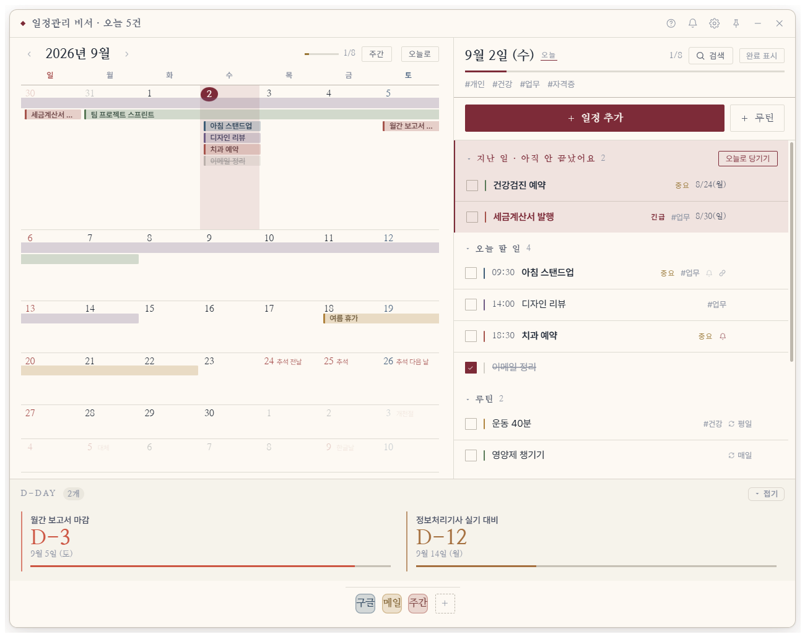
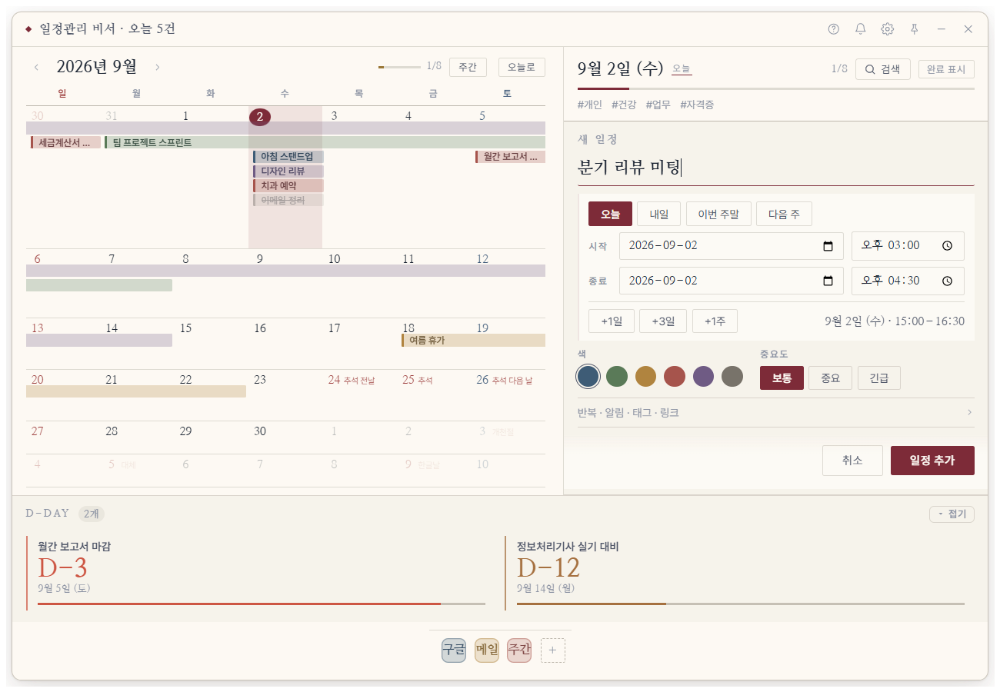
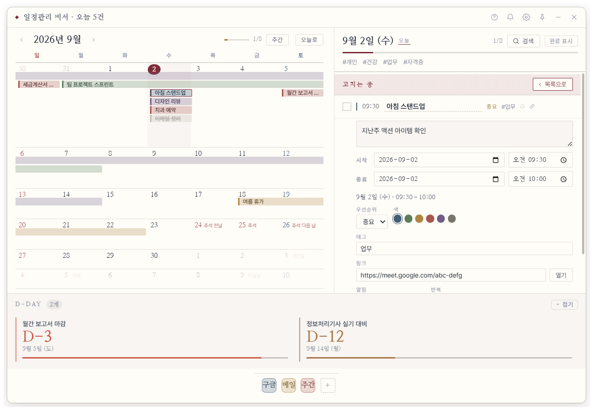
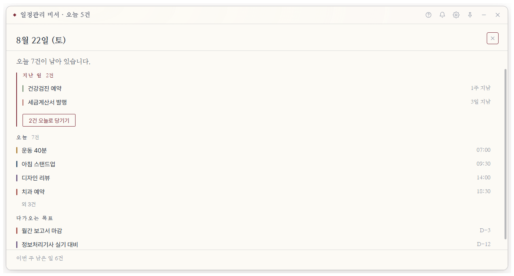
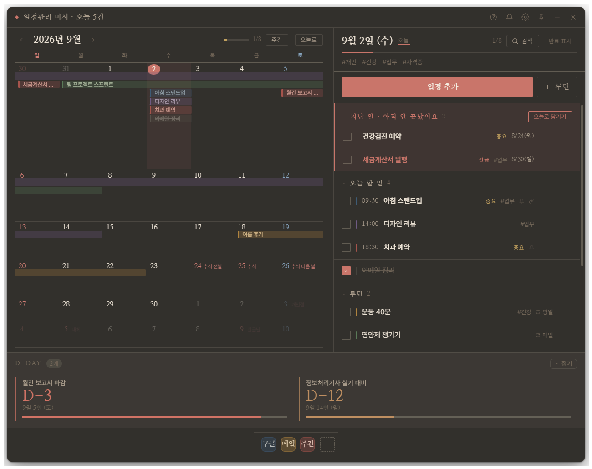

# 일정관리 비서 — 데스크톱 위젯

바탕화면에 상주하는 프레임리스 일정관리 위젯. 왼쪽에서 **캘린더로 장기 계획의 흐름**을 보면서
오른쪽에서 **그날의 할 일**을 짜는 것이 핵심 사용 흐름이다.

물어봐야 답하는 장부가 아니라 **먼저 말하는 비서**를 지향한다 — 밀린 일을 목록 맨 위로 끌어
올리고, 하루에 한 번 아침 브리핑을 띄우고, 창을 열지 않아도 트레이가 오늘 몫을 보고한다.

Electron + 순수 ES 모듈. **빌드 스텝이 없다** — 코드를 고치고 앱을 다시 켜면 그대로 반영된다.



## 화면 구성

왼쪽은 **장기 계획의 흐름**(기간 일정이 주 행을 가로지르는 막대로 그려진다),
오른쪽은 **고른 날짜의 할 일**. 아래는 D-Day 대시보드와 퀵 런처 도크다.

기한이 지났는데 안 끝난 일은 고른 날짜와 무관하게 **`지난 일`** 로 목록 맨 위에 올라오고,
`오늘로 당기기` 한 번이면 전부 오늘로 옮겨진다(되돌리기 한 번으로 취소).

### 일정 추가 — 시작과 종료가 늘 나란히



모드 전환이 없다. **둘이 같으면 하루짜리**, 종료를 뒤로 밀면 그대로 기간 일정이 된다.
시각 칸은 비워 두면 종일. 폼 아래 한 줄이 만들어질 일정을 그대로 되읽어 준다 —
`8월 22일 (토) · 15:00–16:30`.

### 항목 상세 — 만들 때와 같은 배치



### 아침 브리핑 — 먼저 말하는 쪽



하루에 한 번, 앱을 처음 켤 때. 밀린 일 → 오늘 → 다가오는 목표 → 이번 주 몫 순서.
할 말이 없으면 뜨지 않는다.

### 가죽(다크) 테마



## 기능

### 캘린더
- 월 뷰. 기간 일정은 **주 행을 가로지르는 막대**로 그려져 장기 계획의 흐름이 한눈에 보인다.
  여러 주에 걸친 막대는 같은 높이(레인)로 이어지며, 칸에 안 들어가면 `+N` 으로 접힌다.
- 단일 일정은 색 점, 날짜 칸 우상단에 그날 미완료 개수, 헤더에 이번 달 완료율.
- 날짜 클릭 → 오른쪽 목록이 그날로 이동. 목록 항목을 날짜 칸에 **끌어다 놓으면 일정 배치**.
- **막대를 다른 날로 끌면 일정이 옮겨진다** (기간 길이는 그대로).
- **날짜에 커서를 올리면 그 칸에 `+` 가 뜬다.** 캘린더 쪽 일정 추가 입구는 이것 하나다.
- **날짜를 눌러 옆으로 끌면 기간이 잡히고**, 끄는 동안 `8/11(화) → 8/14(금) · 4일간` 배지가
  따라다닌다. 며칠짜리인지 칸을 세어 볼 필요가 없다.
- **트랙패드 두 손가락 좌우 스와이프로 달을 넘긴다** (주간 보기에서는 주 단위).
  관성 스크롤이 쏟아져도 한 번의 스와이프는 한 달만 움직인다.
- **월간 / 주간 전환** — 헤더의 `주간` 버튼. 좁게 세워 둔 위젯에서는 주간 쪽이 읽기 쉽다.
- 날짜를 **우클릭**하면 그 자리에서 바로 일정을 만든다(당일 / 3일 / 1주).
- 키보드: `←→` ±1일 · `↑↓` ±1주 · `PageUp/Down` ±1달 · `T` 오늘.

### 할 일 목록
- **지난 일** / 선택한 날짜 / 진행 중인 장기 계획 / 언젠가(날짜 미지정) 네 섹션.
- **일정을 만드는 입구는 오른쪽 위 `+` 하나뿐이다.** 예전에는 전용 입력칸이 따로 있어
  같은 일을 하는 길이 둘로 갈렸다. 한 줄 문법은 버리지 않고 **추가 폼의 제목칸이 그대로
  이해한다** — `회의 @내일 15:00 #업무` 처럼 치면 띄어쓰기를 칠 때마다 그 토큰이
  제목에서 빠져 아래 칸으로 옮겨 간다. 무엇이 옮겨졌는지 칩으로 잠깐 보여 준다.
- 문법을 전혀 몰라도 **누르기만 해서** 일정을 만든다.
  - 언제: `오늘` `내일` `이번 주말` `다음 주` 버튼 + 달력 선택(타이핑도 됨)
  - **시작과 종료가 늘 나란히 있고, 둘이 같으면 하루짜리다.** 모드 전환이 없다.
    `+1일` `+3일` `+1주` 로 종료를 밀면 그대로 기간 일정이 된다.
  - 시작을 옮기면 종료도 **같은 간격을 유지한 채** 따라온다.
    종료가 시작보다 빨라지면 에러를 띄우지 않고 조용히 시작에 맞춘다.
  - 색·중요도는 눌러서 고르고, 반복·알림·태그·링크는 '더보기'에 접어 둔다
  - 폼 아래 한 줄이 **무엇이 만들어지는지 그대로 되읽어 준다** —
    `8월 21일 (금) · 15:00–16:30` / `8월 21일 (금) → 8월 25일 (화) · 5일간`.
    이 줄이 있으면 규칙을 설명하는 안내 문구가 따로 필요 없다.
  - 다른 날짜로 만들면 그 날짜로 따라가 방금 만든 일정을 바로 보여 준다
- **관련 링크**: 일정에 URL 을 붙여 두면 🔗 아이콘이 생기고, 클릭하면 기본 브라우저로 열린다.
  프로토콜 없이 `meet.google.com/abc` 라고 써도 `https://` 를 자동으로 붙인다.
- **빠른 입력(선택)** — 익숙해지면 한 줄로 끝낼 수 있다. 몰라도 되는 기능이라
  화면에 문법표를 늘 띄우지 않고 도움말(`?`)로 옮겼다:

  | 문법 | 뜻 | 예 |
  |---|---|---|
  | `!` / `!!` | 중요 / 긴급 | `보고서!!` |
  | `#태그` | 태그 (여러 개) | `#업무 #팀` |
  | `@오늘 @내일 @모레` | 시작일 | `@내일` |
  | `@월`~`@일` | 다음 해당 요일 | `@금` |
  | `@8/15` `@2026-08-15` | 날짜 지정 | |
  | `~3d` | 시작일 +3일 = 기간 일정 | |
  | `~8/20` | 종료일 지정 | |
  | `15:00` `14시` `오후3시` | 시각 | |
  | `15:00~18:00` | 시작·종료 시각 | |
  | `*파랑 *초록 *노랑 *빨강 *보라 *회색` | 색 | |

  입력하는 동안 무엇이 제목이고 무엇이 날짜로 잡혔는지 미리보기가 실시간으로 뜬다.
- 인라인 편집(제목 더블클릭), 드래그 정렬, 태그 필터.
- **키보드만으로도 쓸 수 있다** — `Tab` 으로 목록에 들어가 `↑↓` 이동, `Space` 완료,
  `Enter` 자세히, `Delete` 삭제. 로빙 탭인덱스라 항목이 50개여도 `Tab` 한 번이면 들어간다.
- **전역 검색** — 검색창은 날짜와 무관하게 전체에서 찾는다. 다른 달의 일정도 잡힌다.
- **우클릭 메뉴** — 완료 / 자세히 / 내일로 미루기 / D-Day 고정 / 복제 / 삭제.

### 시각 (선택)
- 일정마다 **시작 시각 / 종료 시각**을 붙일 수 있다. 비워 두면 종일 일정이다.
- 시각이 있는 일정은 목록 위쪽에 **시간순으로** 서고, 없는 것은 그 아래에서 드래그 순서를 지킨다.
  그래서 '오늘 할 일'이 그대로 그날의 타임라인이 된다.
- 시각이 있으면 `10분 전` `30분 전` `1시간 전` 알림을 쓸 수 있다.
  시각을 지우면 기준점이 없어지므로 이 알림도 함께 지워진다 — 조용히 안 울리는 알림을 남기지 않는다.
- 날짜와 같은 원칙으로 **`'HH:mm'` 로컬 벽시계 문자열**로만 다룬다. `Date` 로 바꾸지 않는다.

### 반복 일정
- 매일 / 매주 / 매월 / 매년. 반복 종료일을 지정하거나 비워서 계속 반복할 수 있다.
- **회차마다 완료 상태가 따로다.** 이번 주 회의를 체크해도 다음 주 회의는 그대로 남는다.
- 한 회차의 ✕ 는 그날만 건너뛴다(규칙은 유지). 규칙째 지우려면 상세의 '반복 전체 삭제'.
- 회차를 레코드로 만들지 않고 규칙 하나만 저장한 뒤 화면에 필요한 구간만 펼친다.
  '매일 10년'을 등록해도 저장되는 건 규칙 한 줄이다.
- 알림은 회차마다 다시 울린다(가장 가까운 지난 회차를 기준으로 계산).
- 현재 반복은 **당일 일정만** 지원한다. 기간 반복은 캘린더 막대 배치가 급격히 복잡해져
  다음으로 미뤘다.

### 비서 노릇
- **지난 일** — 기한이 지났는데 안 끝난 일을 고른 날짜와 무관하게 목록 맨 위에 모은다.
  이게 없으면 어제 못 끝낸 일은 어제 칸에 남아 시야에서 사라진다. 앱이 사용자의 실패를
  숨기는 꼴이라 신뢰가 깨지는 지점이었다.
  `오늘로 당기기` 로 한 번에 옮기고, **되돌리기 한 번**으로 통째로 취소된다.
- **아침 브리핑** — 하루에 한 번, 앱을 처음 켤 때 한 장으로 알려 준다.
  밀린 일 → 오늘 → 다가오는 목표 → 이번 주 남은 몫 순서. 할 말이 없으면 뜨지 않는다.
  설정에서 끄거나 '오늘 브리핑 열기'로 다시 볼 수 있다.
- **트레이가 말한다** — 창을 열지 않아도 툴팁에 `오늘 3건 · 밀린 일 1건`,
  메뉴 맨 위에 오늘 일정 다섯 줄이 뜬다. 누르면 그 일정이 열린다.
  일정 해석은 렌더러만 할 수 있으므로 렌더러가 요약을 만들어 메인에 보고한다.

### 리마인더
- 일정마다 알림 시각을 정해 두면 OS 알림으로 알려 준다
  (당일 오전 9시 / 정오 / 오후 6시, 하루 전, 3일 전, 일주일 전).
  **시각이 있는 일정**에는 `10분 전` `30분 전` `1시간 전` 이 추가로 나타난다.
- 알림을 클릭하면 위젯이 떠오르면서 해당 일정이 열린다.
- 받은 알림은 타이틀바의 종 아이콘에 기록으로 쌓인다. 항목을 누르면 그 일정으로 이동한다.
- 컴퓨터가 꺼져 있던 동안 지나간 알림은 한꺼번에 쏟아내지 않는다.
  6시간이 넘은 건 조용히 지나간 것으로 처리하고 알림을 띄우지 않는다.

> Windows 의 **시스템** 알림 내역(다른 앱의 토스트 히스토리)은 UWP `UserNotificationListener`
> 권한이 필요해 일반 Electron 앱에서는 읽을 수 없다. 그래서 남의 알림을 수집하는 대신
> 이 앱이 자기 일정으로 직접 알리고 그 기록만 보관한다.

### D-Day 대시보드
- 중요한 일정을 고정하면 남은 기간이 프로그레스 바로 표시된다.
- **목록이나 캘린더에서 일정을 끌어다 놓으면 고정된다.** 항목을 펼쳐 버튼을 찾을 필요가 없다.
  날짜 없는 일정과 반복 일정은 '남은 기간' 개념이 없어 거절하고 이유를 알려 준다.
- 목표일이 가까워질수록 바 색이 **쿨톤 → 웜톤으로 점진적으로 전환**되어 시급성이 드러난다.

### 퀵 런처
- 자주 쓰는 사이트와 로컬 스크립트를 도크에 등록해 한 번에 실행.
- 파이썬 스크립트 실행 시 팝오버로 진행 상태와 출력을 보여주고 중단할 수 있다.
- 지원: `.py .pyw .ps1 .bat .cmd .js .exe` + URL / 폴더.

### 데이터 보관 · 내보내기
- **저장 실패는 반드시 화면에 뜬다** — 디스크가 차거나 파일이 잠기면 사라지지 않는 붉은 배너로
  알리고, 그 자리에서 '다시 시도' 하거나 백업으로 빼낼 수 있다.
  저장 결과를 확인하지 않던 시절에는 사용자가 계속 일정을 적다가 앱을 껐다 켠 뒤에야
  전부 날아간 걸 알게 됐다 — 일정 앱에서 가장 나쁜 실패 방식이다.
- **끄기 직전에 마무리 저장** — 저장은 250ms 디바운스라 마지막 편집 직후 종료하면
  그대로 날아간다. 메인이 종료·숨김 전에 렌더러에 마무리를 요청하고 최대 1.5초 기다린다.
- **자동 백업** — 저장할 때 하루 한 번 직전 파일을 `backups/` 로 떠 두고 최근 14일치를 보관한다.
  설정에서 '백업 폴더 열기'로 바로 갈 수 있다.
- **백업 내보내기(.json)** — 일정·바로가기·설정을 통째로. 이 앱으로 그대로 되돌릴 수 있다.
- **캘린더 내보내기(.ics)** — 구글·아웃룩 캘린더로 가져갈 수 있는 표준 형식.
  시각이 없으면 종일 이벤트로, 있으면 시간 이벤트로 쓴다.
  반복 일정은 `RRULE`, 건너뛴 회차는 `EXDATE` 로 옮긴다.
  시간 이벤트는 `TZID` 없는 **floating local time** 으로 쓴다 — 이 앱은 타임존 개념이
  없으므로 '보는 사람의 현지 시각'이라는 floating 의 뜻이 데이터와 정확히 맞는다.
  없는 타임존 정보를 지어내 `VTIMEZONE` 을 싣는 것보다 정직하다.
- **가져오기** — '합치기'는 기존 일정을 건드리지 않고 없는 id 만 더한다. '덮어쓰기'는 통째로 교체.
  둘 다 되돌리기(Ctrl+Z)로 취소된다. 형식이 아닌 파일은 거부하고 기존 데이터를 지킨다.

### 위젯 동작
- **자정이 지나면 스스로 오늘로 넘어간다.** 며칠씩 떠 있는 위젯이라 이게 없으면
  '오늘 할 일'이 어제 목록을 계속 보여 준다. 어제 날짜를 보고 있었으면 오늘로 따라가고,
  다른 날을 일부러 골라 뒀으면 건드리지 않는다. 절전에서 깰 때도 다시 확인한다.
  브리핑은 자정에 바로 띄우지 않고 다음에 창을 볼 때 보여 준다.
- 프레임리스 · 투명 · 크기 자유 조절. 창 위치와 크기는 저장되며, 모니터 구성이 바뀌어
  저장된 좌표가 화면 밖이면 주 모니터 중앙으로 되돌린다.
- 트레이 상주. 닫기(✕)는 종료가 아니라 트레이로 숨김.
- **클릭 통과(잠금) 모드** — 위젯이 마우스를 통과시켜 배경처럼 된다.
  `Alt+Shift+S` 전역 단축키로 언제든 해제할 수 있다.
- 비활성일 때 배경으로 물러나고(디밍), 마우스를 올리면 복원된다.
- 종이(라이트) / 가죽(다크) 테마, 배경 투명도·글자 크기 조절, 창 크기 프리셋.
- **부팅 시 자동 시작** — 켜면 로그인할 때 트레이에만 조용히 올라온다(창은 뜨지 않음).

> 자동 업데이트는 넣지 않았다. 코드 서명이 없는 배포판은 업데이트마다 Windows 경고가
> 반복되고, 릴리스를 실제로 올려야만 동작한다. 대신 설정에 릴리스 페이지를 여는
> '새 버전 확인' 을 두었다.

## 디자인

고풍스러운 다이어리를 옮겨 온 톤. 종이(따뜻한 아이보리)와 잉크(먹빛)의 대비를 기본으로,
날짜와 표제는 명조 계열 세리프로 잡고 본문은 작은 글씨에서 또렷한 산세리프를 쓴다.
칸을 면으로 채우지 않고 가느다란 괘선으로 나누며, 모서리는 거의 각지게 두어 인쇄물에 가깝게.

- 아이콘은 전부 인라인 SVG 선 아이콘(`lib/icons.js`). 이모지는 OS·폰트마다 모양과 색이
  제각각이라 톤이 깨져서 쓰지 않는다.
- 일정 색은 형광 원색 대신 안료 계열(청람·쑥·치자·다홍·자주·회묵)로 채도를 낮췄다.
- 강조색은 인장의 붉은빛. 다크 테마에서는 같은 계열의 적동색으로 낮춰 눈부심을 막는다.
- **배경 투명도는 CSS 배경 알파로 조절한다.** `BrowserWindow.setOpacity()` 는 Windows 의
  `transparent: true` 창에서 합성이 불안정해 영역마다 반영이 들쭉날쭉했다. 배경 알파만
  조절하면 전 영역에 균일하게 먹고 글자는 또렷하게 남는다.

## 실행

```bash
npm install
npm start
```

### 설치 파일 만들기

```bash
npm run icon    # build/icon.png + icon.ico 생성 (tools/icon.html 을 구움)
npm run dist    # dist/ScheduleWidget-Setup-<version>.exe
```

NSIS 설치 관리자를 만든다. 설치 위치를 고를 수 있고, 관리자 권한 없이 사용자 단위로 설치되며,
제거해도 사용자 일정 데이터는 남긴다.

> **코드 서명은 하지 않는다.** 인증서가 없으면 설치 시 Windows SmartScreen 경고가 뜬다.
> 개인 배포·포트폴리오용으로는 그대로 써도 되고, 실제 판매 시에는 인증서가 필요하다.

> `.ico` 는 `tools/make-icon.js` 가 직접 만든다. electron-builder 의 PNG→ICO 변환기가
> 이 환경에서 WebAssembly 메모리 할당에 실패해서, ICO 컨테이너를 규격대로 직접 조립한다.

### README 스크린샷 다시 뽑기

```bash
npm run screens
```

실제 앱의 렌더러를 그대로 띄워 `capturePage` 로 굽는다(`tools/capture.js`).
사용자 데이터는 건드리지 않고 `tools/capture-preload.js` 의 샘플만 쓰며,
창은 화면 밖(-4000)에 띄우므로 작업 중에 눈에 띄지 않는다.
화면이 바뀌면 이 명령만 다시 돌리면 된다 — 손으로 찍는 것과 달리 결과가 재현된다.

### 브라우저 미리보기

UI 만 빠르게 확인할 때는 Electron 없이 브라우저로 띄울 수 있다.

```bash
node tools/dev-server.js
```

`http://localhost:5599/dev.html` — `src/renderer/dev-stub.js` 가 `window.api` 를 모의하고
샘플 데이터를 넣어 준다. 데이터는 localStorage 에만 저장되어 실제 앱 데이터와 섞이지 않는다.

## 구조

```
src/
├─ main/                    메인 프로세스 (Node)
│  ├─ main.js               창 생성 · 트레이 · 전역 단축키 · IPC
│  ├─ preload.js            contextBridge 로 노출하는 유일한 다리
│  ├─ storage.js            원자적 저장 + 손상 파일 자동 격리
│  ├─ windowState.js        창 위치/크기 영속화 + 화면 밖 복구
│  └─ runner.js             퀵 런처 실행기 (경로·프로토콜 검증)
└─ renderer/                렌더러 (순수 ES 모듈, 번들러 없음)
   ├─ store.js              단일 상태 저장소 + 액션 + 셀렉터
   ├─ app.js                셸 — 타이틀바 · 스플리터 · 설정 · 모듈 마운트
   ├─ lib/date.js           날짜 유틸 (전부 'YYYY-MM-DD' 로컬 문자열)
   ├─ styles/base.css       디자인 토큰 (글래스모피즘 · 다크/라이트)
   ├─ calendar/             월 뷰 + 장기 계획 막대
   ├─ todo/                 할 일 목록 + 빠른 입력 파서 + 추가 폼
   ├─ dashboard/            D-Day 패널
   └─ launcher/             퀵 런처 도크
```

각 뷰 모듈은 `create*({ root, store })` → `{ destroy() }` 팩토리 하나만 내보내고,
`root` 안에만 그린다. 상태는 직접 고치지 않고 `store` 의 액션 함수로만 바꾼다.
모듈 간 계약은 [CONTRACT.md](CONTRACT.md) 에 정리되어 있다.

## 설계 메모

- **날짜는 전부 `'YYYY-MM-DD'` 로컬 문자열로만 다룬다.** `Date` 객체를 주고받으면
  타임존/직렬화에서 하루씩 어긋나는 사고가 난다.
  **시각도 같은 원칙으로 `'HH:mm'` 로컬 벽시계 문자열**이다. 시각을 넣으면서 이 규약을
  깨는 대신 선택 필드(`startTime`/`endTime`)를 더했다 — 기존 데이터는 전부 `null`
  (종일)로 읽히므로 후방호환이 그냥 된다.
- **날짜 계산은 `lib/date.js` 만 쓴다.** store 가 `new Date(key)` + `toISOString()` 으로
  자체 구현한 `dayDiff`/`shift` 를 들고 있었는데, UTC 파싱과 로컬 연산이 섞여 있어
  README 가 경고한 바로 그 함정이었다. 지금은 `diffDays`/`addDays` 로 통일했다.
- **Electron 은 지원되는 메이저에 머문다.** Electron 은 최신 3개 메이저만 보안 패치를 받는다.
  33 에 머물러 있는 동안은 Chromium 취약점이 그대로 남는데, 배포하는 데스크톱 앱에서는
  기능 하나보다 이쪽이 훨씬 무겁다. 43 으로 올린 뒤 프레임리스·투명 창 합성, 번들 폰트
  적용(CSP `font-src` 함정), 렌더러 부팅을 실제 창에서 다시 확인했다.
- **시각 입력은 로케일이 폭을 정한다.** 한국어 `<input type="time">` 은 `오후 03:00` 에
  시계 아이콘까지 그린다. 좁게 잡으면 Chromium 이 분 자리를 말없이 잘라 내는데,
  `scrollWidth` 로도 잡히지 않아 코드로는 알 수 없다. 실제 창을 캡처해서야 보였다.
- **저장 경로에 화이트리스트가 있다는 걸 잊으면 데이터가 조용히 사라진다.**
  `storage.saveData` 는 렌더러가 보낸 객체를 그대로 쓰지 않고 필드를 골라 다시 조립한다.
  안전하지만, store 에 새 필드를 더하고 여기 안 더하면 **저장은 성공한 것처럼 보이면서
  그 필드만 사라진다.** 실제로 알림 기록(`reminderLog`)이 한동안 그렇게 유실됐다.
- **되돌리기는 사용자가 한 '한 동작' 단위여야 한다.** '밀린 일 20건 오늘로'를 한 건씩
  옮기면 되돌리기 스택에 20개가 쌓여 Ctrl+Z 를 스무 번 눌러야 한다.
  일괄 동작은 `moveTasksTo()` 처럼 스냅샷을 한 번만 찍는 액션으로 만든다.
- **저장은 원자적으로.** 임시 파일에 쓰고 `fsync` 후 `rename` 으로 교체하므로,
  저장 도중 프로세스가 죽어도 기존 데이터는 온전하다. 파일이 깨져 있으면 덮어쓰지 않고
  `schedule-data.corrupt-<시각>.json` 으로 격리한 뒤 사용자에게 알린다.
- **연속 편집은 되돌리기 한 칸으로 묶는다.** 스냅샷 방식이라 액션마다 전체를 복제하는데,
  메모를 치면 `updateTask` 가 300ms 마다 불려 2000건 기준 매번 20ms 씩 멈췄다.
  같은 대상·같은 필드 편집이 1.2초 안에 이어지면 첫 스냅샷 하나로 묶는다.
  성능도 성능이지만, Ctrl+Z 가 글자 몇 개씩 되돌리는 게 더 이상했다.
- **되돌리기 깊이는 일정 수에 따라 줄인다** (50 → 25 → 12).
  스냅샷 하나가 일정 수에 비례하므로 깊이를 고정하면 큰 데이터에서 메모리가 같이 커진다.
  50단계를 거슬러 올라가는 사람은 없으니 깊이를 양보한다.
- **렌더러를 신뢰하지 않는 원칙은 창 자체에도 적용한다.** `will-navigate`·`will-redirect`·
  `will-attach-webview` 를 모두 막고 권한 요청은 전부 거절한다. 파일 하나를 위젯에
  끌어다 놓기만 해도 기본 동작은 그 파일로 navigate 하는 것이라, 막지 않으면 앱이
  통째로 사라지고 preload 다리가 붙은 낯선 문서가 남는다.
- **보이지 않는 애니메이션이 CPU 를 통째로 먹는다.** 퀵 런처의 실행 중 스피너 링은
  `opacity: 0` 으로 숨겨 두고 `animation: … infinite` 는 항상 걸려 있었다.
  투명해도 애니메이션이 살아 있으면 브라우저는 매 프레임 합성을 계속하므로,
  바로가기 몇 개만 있어도 상시 60fps 가 돌았다. **유휴 CPU 가 코어의 33%.**
  애니메이션을 `.is-running` 안으로 옮기니 **0.03% 로 떨어졌다(약 1000배).**
  상시 구동 위젯에서는 `opacity`/`visibility` 로 숨기는 것과 애니메이션을 끄는 것이
  전혀 다른 일이다. 숨긴 요소에 무한 애니메이션을 남기지 말 것.
- **임박 표시 같은 '살아 있는' 연출은 창이 활성일 때만 돌린다.** 트레이로 내려간 화면을
  60fps 로 다시 그리는 것은 배터리만 쓰는 일이다. `html.is-inactive` / `data-hidden`
  두 상태를 CSS 가 보고 스스로 멈춘다.
- **막대는 날짜 칸의 자식이 아니라 형제 레이어다.** 그래서 `e.target.closest('.cal-day')`
  는 막대 위에서 null 이 된다. 기간 드래그가 '일정이 있는 칸'을 지나는 순간 멈춰 있던
  원인이었다 — 일정이 없는 사람에게만 동작하는 기능이었던 셈이다.
  끄는 동안에는 막대의 `pointer-events` 를 꺼서 칸이 계속 잡히게 한다.
- **블러 레이어는 셸 하나만.** 백드롭 블러는 `dwm.exe` 의 GPU 부하가 큰 연산이라
  반경을 16px 로 제한하고 하위 패널이 각자 블러를 쌓지 못하게 했다. 저사양을 위해
  블러를 끄는 폴백이 있고, 끌 때는 배경 알파를 올려 가독성을 지킨다.
- **렌더러를 신뢰하지 않는다.** 링크 프로토콜과 스크립트 경로/확장자는 메인 프로세스에서
  다시 검증하고, 프로세스는 항상 `shell:false` + 인자 배열로 spawn 한다.
- **userData 경로를 이름으로 못박는다.** Electron 의 저장 위치는 `app.getName()` 을 따르는데,
  설치본은 `productName`('일정관리 비서'), 개발 실행은 `package.json` 의 `name`
  ('schedule-widget') 이 되어 서로 다른 폴더를 쓴다. 그대로 두면 설치 직후
  기존 일정이 사라진 것처럼 보인다. `app.setPath('userData', ...)` 로 한 곳만 쓰게 했다.
- **CSP 에 `font-src 'self'` 가 반드시 있어야 한다.** `default-src 'none'` 만 두면
  `@font-face` 가 **조용히** 차단되어 시스템 폰트로 폴백된다. 에러도 안 나고 글자는 그대로
  보여서 알아채기 어렵다. 실제로 이 함정에 빠져 번들 폰트가 한동안 무용지물이었다.
  그래서 개발 미리보기(`dev.html`)도 실제 앱과 **같은 CSP** 를 쓴다 — 미리보기에서만
  되는 것을 '된다'고 착각하지 않기 위해서다.

## 라이선스

MIT
