# 일정관리 비서 — 데스크톱 위젯

바탕화면에 상주하는 프레임리스 일정관리 위젯. 펼쳐 놓은 다이어리처럼 왼쪽 면에서
**캘린더로 장기 계획의 흐름**을 보면서 오른쪽 면에서 **그날의 시간표**를 짜는 것이 핵심 사용 흐름이다.

물어봐야 답하는 장부가 아니라 **먼저 말하는 비서**를 지향한다 — 오늘이 어떤지 한 줄로 먼저
말하고, 밀린 일을 위로 끌어 올리고, 하루에 한 번 아침 브리핑을 띄우고,
창을 열지 않아도 트레이가 오늘 몫을 보고한다.

Electron + 순수 ES 모듈. **빌드 스텝이 없다** — 코드를 고치고 앱을 다시 켜면 그대로 반영된다.

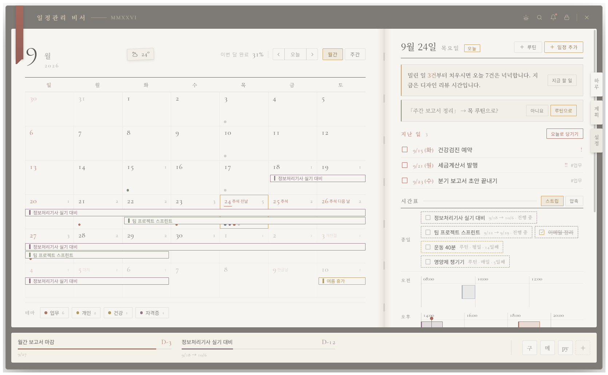

## 화면 구성

펼쳐 놓은 다이어리 한 권이다. **왼쪽 면은 달력**(기간 일정이 주 행을 가로지르는 막대),
**오른쪽 면은 고른 날의 기록면**, 아래 리본에는 D-Day 와 퀵 런처가 얹힌다.
오른쪽 면은 화면을 갈아 끼운다. 면 바깥으로 삐져나온 **책갈피 탭**이 면을 고른다 —
**하루**(고른 날의 시간표와 할 일) · **계획**(주 · 달 목표) · **설정**. 탭 이름은 그 면이 하는 일이다.
일정 추가 · 항목 상세는 그 면 안의 한 장이고, 닫으면 열었던 면으로 돌아간다(`‹ 하루` · `‹ 계획`).

하루 화면은 위에서부터 **날짜 머리**(`＋ 루틴` `＋ 일정 추가`) → **비서의 한 줄** →
**지난 일** → **시간표**(종일 띠 + 스트립/압축) → **언젠가** → **한 줄 기록** 순서다.
기한이 지났는데 안 끝난 일은 고른 날짜와 무관하게 `지난 일` 로 올라오고,
`오늘로 당기기` 한 번이면 전부 오늘로 옮겨진다(되돌리기 한 번으로 취소).

### 일정 추가 — 한 줄로 쳐도, 눌러서 골라도

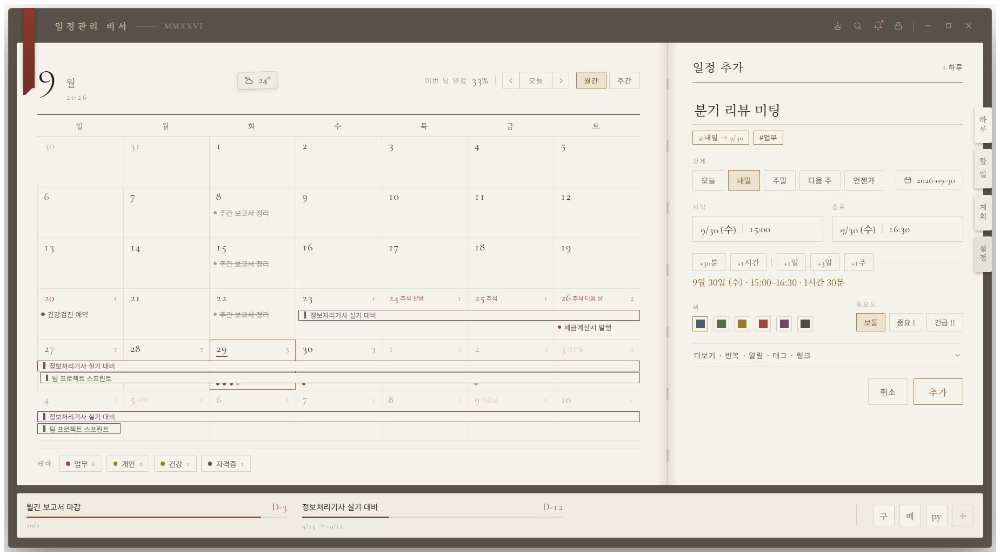

만드는 단추는 날짜 머리의 **`＋ 루틴` `＋ 일정 추가` 둘**이다(일정은 단축키 `N`).
날짜 없이 적어 둘 일은 언제 줄에서 `언젠가` 를 누른다 — 같은 화면이 그대로 받는다.

제목칸에 `분기 리뷰 미팅 @내일 #업무` 처럼 치면 띄어쓰기를 칠 때마다 토큰이 칩으로 옮겨 간다
(`@내일 → 9/23`). 문법을 몰라도 `오늘 · 내일 · 주말 · 다음 주 · 언젠가` 와 시작 · 종료 칸을 눌러
전부 고를 수 있다. **시작 = 종료면 하루짜리**, 종료를 밀면 그대로 기간 일정이다.
기간 일정이면 `체크` 줄이 나온다 — `끝나면 한 번`(이사 준비처럼 다 끝났을 때 한 번) ·
`날마다`(기출 정리처럼 기간 동안 하루하루).
오른쪽 한 줄이 만들어질 일정을 되읽어 준다 — `9월 23일 (수) · 15:00–16:30`.

### 항목 상세 — 보이는 제목이 그대로 입력칸

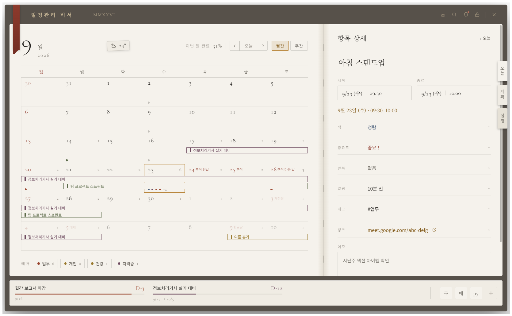

값은 한 줄에 하나(색 · 중요도 · 반복 · 알림 · 태그 · 링크)이고, 누르면 그 자리에서 고른다.
누를 수 있는 줄은 오른쪽 끝의 작은 `⌄` 와 커서를 올렸을 때의 금박이 말해 준다 — '눌러서 변경' 같은
글을 달지 않는다. 링크는 `↗` 로 연다.
완료 · 내일로 미루기 · D-Day 고정 · 마감까지 계획 · 복제 · 삭제는 아래 칩으로 — 항목에 대한
동작은 여기 한 벌이다(목록 줄에 커서를 올려도 단추가 따로 뜨지 않는다. 우클릭 · `Delete` 는 된다).

### 계획 — 주 · 달을 크게

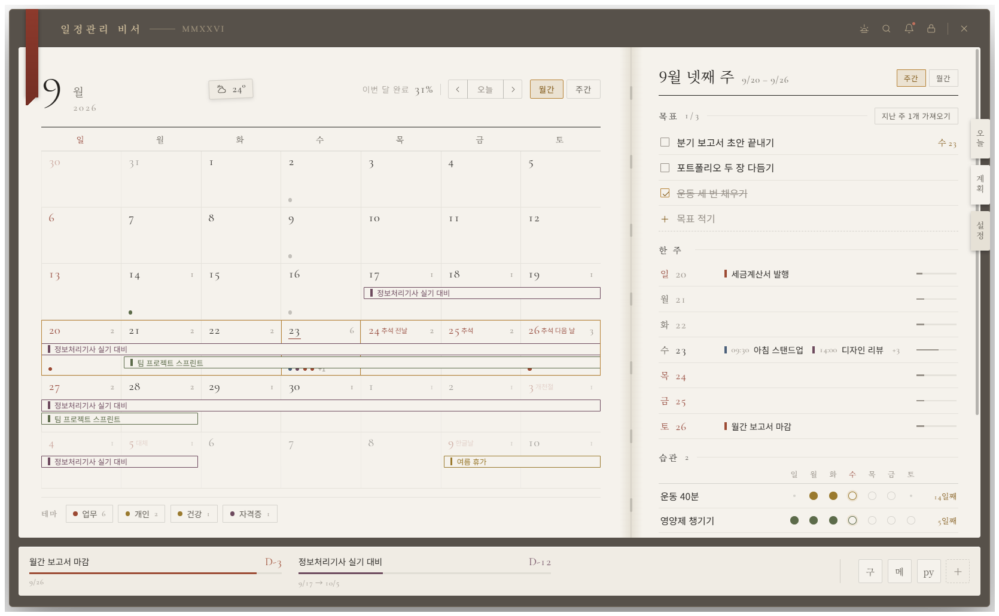

책갈피 **계획**. 하루 시간표보다 큰 단위 — 이번 주에 끝낼 것, 이번 달에 이룰 것 — 을 날짜 없이
**목표**로 적어 두었다가 나중에 요일에 놓는다.

- **주간** — 목표 목록 + 한 주 일곱 날 + 습관표. 목표를 요일 줄(또는 왼쪽 달력의 날짜 칸)로 끌어 놓으면
  그날의 일정이 되고, 목표 줄에는 놓인 요일(`수 23`)이 붙는다. 요일 줄을 누르면 그날의 하루 화면으로.
  요일 줄 오른쪽의 **얇은 막대는 그날 잡힌 시간**이다(여덟 시간을 넘으면 인주색) — 빈 날이 보이니
  목표를 거기로 끌게 된다.
- **습관표** — 루틴 × 요일 격자. 한 날은 안료 점, 안 한 날은 빈 동그라미, 하기로 하지 않은 날은 점 하나.
  칸을 눌러 그 자리에서 체크하고, 오른쪽에 `14일째` 가 붙는다. 앞날은 미리 체크할 수 없다.
- **월간** — 이 달의 목표 + 주마다 잡힌 목표(`첫째 주 … 1/2`) + 한 달 결산. 목표를 주 줄로 끌면
  그 주의 목표가 되고, 주 줄을 누르면 그 주의 계획으로 들어간다.
- **결산** — `끝낸 일 34 / 50 · 완료 68% · 가장 바쁜 주 둘째 주`, 태그별 막대(`#업무 12`),
  `가장 오래 끈 일`, `루틴 최고 기록`. 월말에 한 장으로 돌아본다.
- 어느 주 · 어느 달인지는 **왼쪽 달력이 정한다** — 날짜를 누르면 그 주가, 달을 넘기면 그 달이 된다.
  짜고 있는 주는 달력에 **금박 테두리**로 보인다. 이 화면에 따로 넘기는 단추는 없다.
- 지난 주 · 지난 달에 날짜도 못 잡고 남은 목표가 있으면 `지난 주 1개 가져오기` 가 뜬다.
- 목록 끝 밑줄에 바로 적는다(`#태그` · `!` 중요도는 알아듣는다). 목표도 일정과 같은 레코드라
  상세 · 검색 · 되돌리기 · 백업을 그대로 탄다.

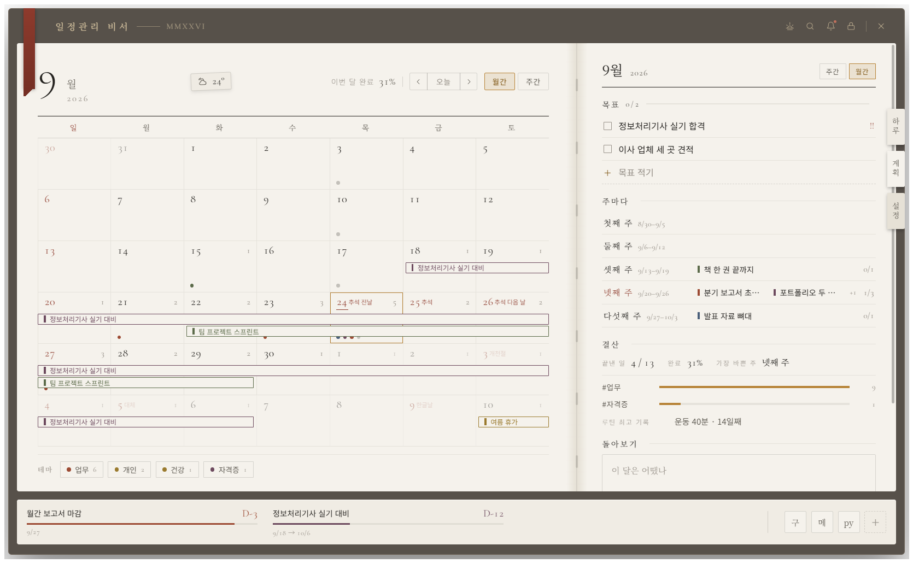

### 테마 — 흩어진 일을 한 덩어리로

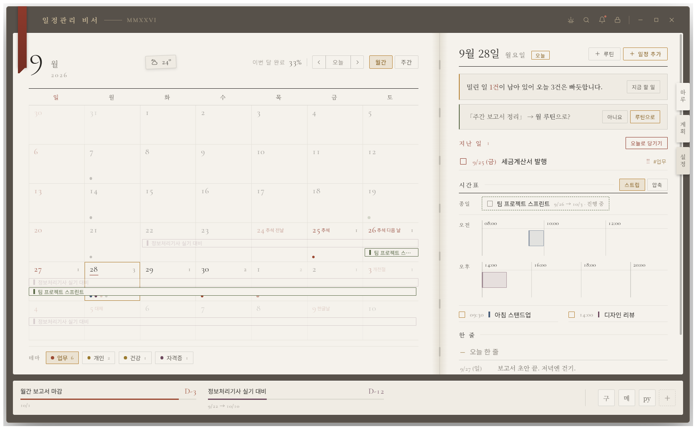

달력 발치의 띠가 테마(태그)다. `테마  ● 업무 6  ● 개인 2  ● 건강 1  ● 자격증 1` —
남은 일이 많은 순서로 여덟 개까지 선다. 색은 그 테마에서 가장 많이 쓴 안료라, 따로 정하지 않아도
테마마다 색이 생긴다.

하나를 누르면 **그 테마만 지면에 남는다.** 나머지 막대와 점은 지워지는 대신 한 걸음 물러나고
(흐려지고), 날짜 칸의 건수도 그 테마 몫으로 바뀐다. 오른쪽 면은 그 테마만 걸러 보여 준다.
다시 누르면 풀린다.

지우지 않고 흐리게 두는 이유: 걷어내면 지면이 텅 비어서 '그 테마가 이 달 어디에 놓였는지'를
볼 수 없다. 흐름 위에 얹혀 있어야 한 덩어리로 읽힌다.

### 돌아보기 — 지난 주 · 지난 달

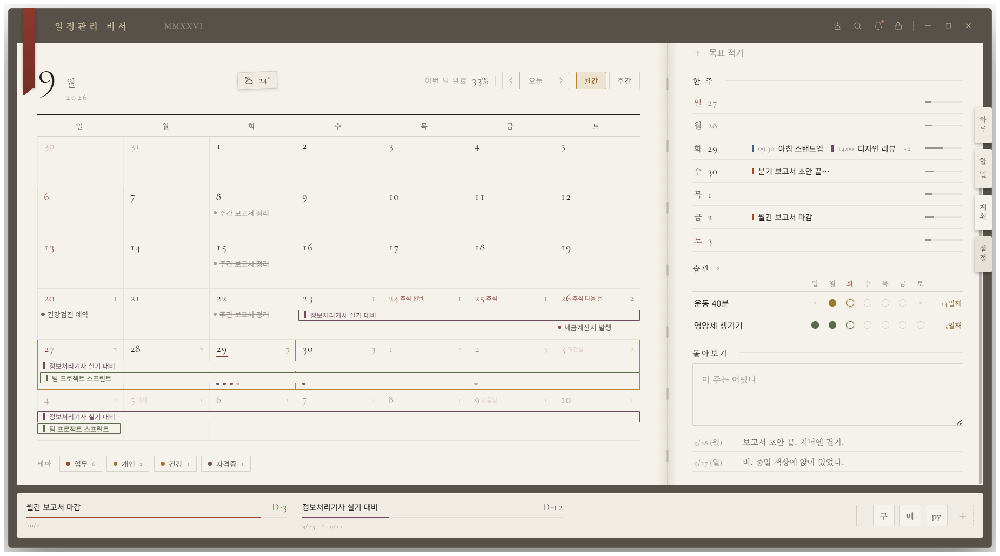

계획 화면 맨 아래. 그 기간에 적어 둔 **한 줄들이 펼쳐지고**, 그 위에 한 문단을 덧댄다
(`이 주는 어땠나` · `이 달은 어땠나`). 달력에서 지난 주 · 지난 달로 넘기면 그때의 기록이 그대로 뜬다.

아직 오지 않은 기간에는 자리째 걷는다 — 돌아볼 것이 없다. 주 기능(계획 · 목표)을 밀어내지 않도록
맨 아래에 조용히 둔다.

### 한 줄 기록 — 오늘이 어땠는지

하루 화면 맨 아래 `한 줄`. 고른 날짜에 한 줄이 붙고, 아래로 최근에 적어 둔 줄이 쌓인다
(`9/22 (화)  보고서 초안 끝. 저녁엔 걷기.`). 줄을 누르면 그날로 간다.

일정은 '할 일'을 적지만 지나고 나서 남는 건 그날이 어땠는지다. 일정과 섞지 않고
날짜에 한 줄씩만 붙인다 — 그릇이 단순해야 매일 적게 된다. 백업(.json)에 함께 담긴다.

### 날씨 — 달력에 붙인 스티커

달력 표제 옆에 살짝 비뚤게 붙은 종이 조각(`⛅ 24°`). 커서를 올리면 반듯해지고
`서울 · 구름 조금 · 18° / 27°` 가 뜬다. 누르면 아침 브리핑이 열리고, 브리핑 맨 위에도 한 줄 들어간다.

- 받아오는 일은 **메인 프로세스**가 한다(렌더러는 CSP 가 `default-src 'none'` 이라 네트워크를 쓸 수 없다).
- [Open-Meteo](https://open-meteo.com) — 키도 가입도 없다. 나가는 것은 **설정에서 고른 도시의 좌표뿐**이고,
  IP 위치 조회 같은 것으로 위치를 추측하지 않는다.
- 30분마다 한 번, 창을 다시 볼 때 확인한다. 받은 값은 `userData/weather.json` 에 남고
  네트워크가 없으면 그대로 쓴다. 설정 › 날씨에서 끄면 아예 부르지 않는다.

### 루틴 — 달력에 그리지 않는 되풀이

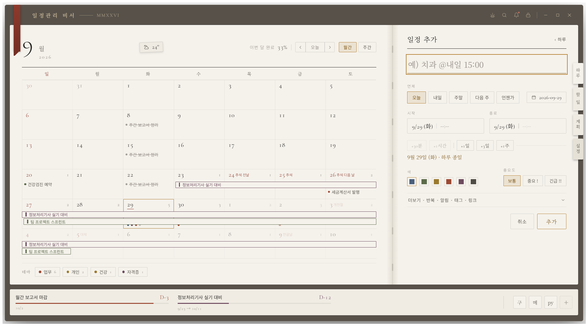

`＋ 일정 추가` 화면의 머리에서 `루틴` 을 누른다. 주기(매일 · 평일 · 주말 · 매주 · 격일 · 매월)와
요일, 시각. 시각을 넣으면 시간표에 네모로, 비워 두면 종일 띠에 놓인다 — 어느 쪽이든 같은 자리에서
체크로 지운다.

### 아침 브리핑 — 먼저 말하는 쪽

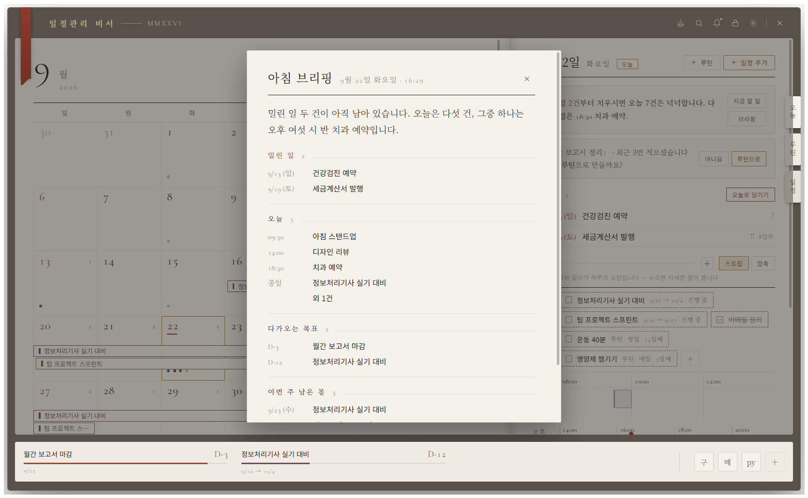

하루에 한 번, 앱을 처음 켤 때. `밀린 일 두 건이 아직 남아 있습니다. 오늘은 다섯 건,
그중 하나는 오후 여섯 시 반 치과 예약입니다.` 처럼 한 문장으로 먼저 말하고,
밀린 일 → 오늘 → 다가오는 목표 → 이번 주 남은 몫 순서로 짚는다. 할 말이 없으면 뜨지 않는다.
다시 보려면 표지의 해돋이 버튼 — 브리핑을 여는 단추는 그것 하나다.

### 설정

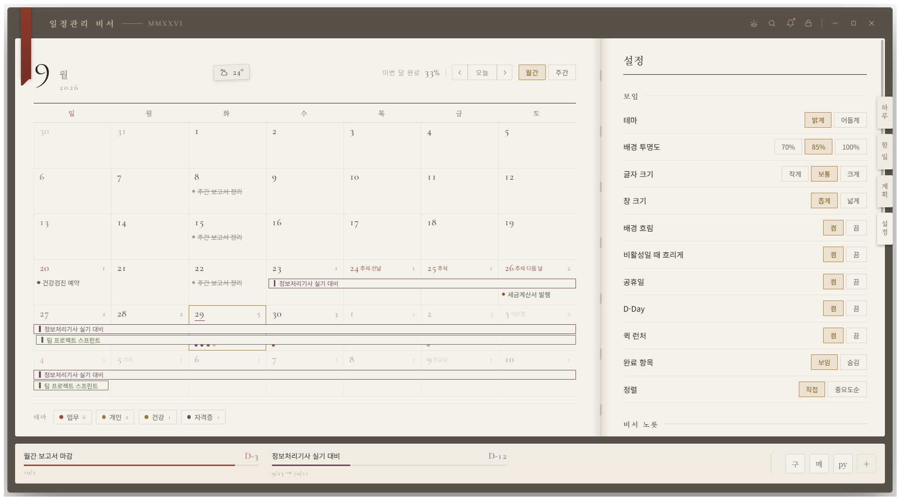

### 다크 테마

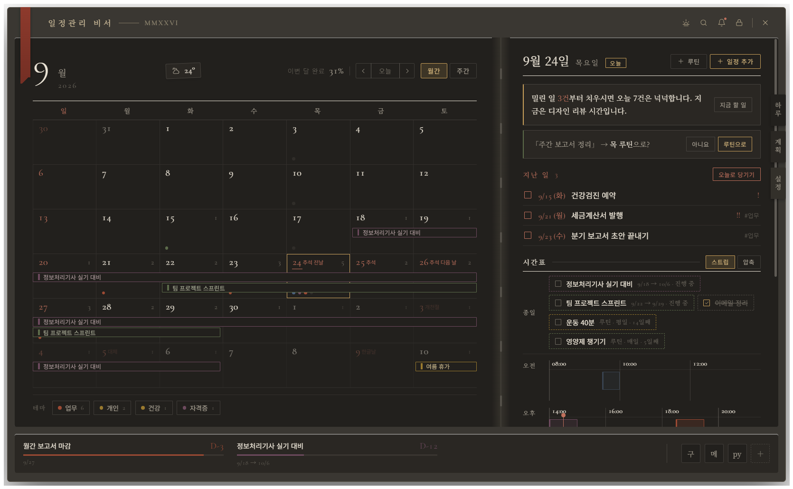

## 기능

### 캘린더
- 월 뷰. 기간 일정은 **주 행을 가로지르는 막대**로 그려져 장기 계획의 흐름이 한눈에 보인다.
  여러 주에 걸친 막대는 같은 높이(레인)로 이어지며, 칸에 안 들어가면 `+N` 으로 접힌다.
- 단일 일정은 색 점, 날짜 칸 우상단에 그날 미완료 개수, 헤더에 이번 달 완료율.
- 날짜 클릭 → 오른쪽 목록이 그날로 이동. 목록 항목을 날짜 칸에 **끌어다 놓으면 일정 배치**.
- **막대를 잡아 옮기고, 양 끝을 잡아 기간을 늘리고 줄인다.**
  끄는 동안 어디로 가는지 칸에 칠해 보여 주고 `8/15(토) → 8/17(월) · 3일간` 배지가 따라온다.
  HTML5 드래그 대신 마우스로 직접 다룬다 — 그래야 미리보기와 기간 조절을 한 방식으로 다룰 수 있다.
  (반복 일정은 규칙 하나를 공유하므로 캘린더에서 옮길 수 없고, 그 이유를 알려 준다)
- **스크롤하지 않는다.** 여섯 주가 면의 남은 세로를 똑같이 나눠 갖는다. 창이 낮아 칸이
  100px 보다 짧아지면 숫자와 막대를 조금 줄여 레인을 하나 더 들인다.
- **날짜를 눌러 옆으로 끌면 기간이 잡히고**, 끄는 동안 `8/11(화) → 8/14(금) · 4일간` 배지가
  따라다닌다. 며칠짜리인지 칸을 세어 볼 필요가 없다.
- **트랙패드 두 손가락 좌우 스와이프로 달을 넘긴다** (주간 보기에서는 주 단위).
  관성 스크롤이 쏟아져도 한 번의 스와이프는 한 달만 움직인다.
- **머리의 조작은 한 줄에 선다** — `이번 달 완료 68% │ ‹ 오늘 › │ [월간][주간]`.
  `‹ 오늘 ›` 는 한 덩어리(앞 · 지금 · 뒤)고, 이미 오늘을 보고 있으면 `오늘` 이 흐려진다.
  보기는 **켜진 쪽이 금박으로 차는 칩**이라 지금 무엇을 보고 있는지가 보인다(시간표의 칩과 같은 모양).
- 날짜를 **우클릭**하면 그 자리에서 바로 일정을 만든다(당일 / 3일 / 1주).
- 키보드: `←→` ±1일 · `↑↓` ±1주 · `PageUp/Down` ±1달 · `T` 오늘.

### 하루 화면 (오른쪽 면)
- **날짜 머리** — `9월 22일 화요일 [오늘]`. 일정을 만드는 단추 `＋ 일정 추가` 가 날짜 바로 옆에
  하나 있다(단축키 `N`). 시간표 · 종일 띠 · 언젠가에는 추가 단추를 따로 두지 않는다.
- **비서의 한 줄** — `밀린 일 2건부터 치우시면 오늘 7건은 넉넉합니다. 다음 일정은 18:30 치과 예약.`
  넉넉한지는 어림으로 잰다(지금부터 밤 10시까지 빈 시간 대 시각 없는 일 × 30분).
  `지금 할 일` 을 누르면 지금 붙잡을 일 하나를 이유와 함께 골라 준다(`다른 거` 로 넘김).
  같은 일을 세 번 넘게 손으로 적었으면 그 아래에 **루틴으로 만들까요?** 가 한 줄 뜬다.
- **지난 일** — `[□] 9/13 (일) 건강검진 예약 …… #업무`. 미루기 · 삭제는 줄을 눌러 여는 상세에서.
- **시간표** — 하루의 **모양**을 맡는다. 두 시안을 머리의 칩으로 고른다:
  - **스트립**(기본) — 오전 08–14시 · 오후 14–21:30시 두 띠에 **글자 없는 네모**.
    위치와 길이가 곧 하루의 모양이고, 이름은 아래 두 줄 체크 목록이 맡는다.
    네모를 누르면 자세한 창이 뜬다(완료 · 내일로 미루기 · 자세히 · 닫기). 지난 네모는 흐리게,
    `지금 16:18` 은 띠 아래에 붙는다. 자료가 띠 밖에 있으면 띠를 넓힌다.
  - **압축** — 일정이 있는 시간대만 펼치고, 60분 넘게 비면 `3시간 30분 비어 있음 · 지금 16:19`
    한 줄로 접는다(누르면 펼쳐짐). 네모 높이는 `max(36, 분 × 0.7)`px.
  - **종일 띠** — 시각 없는 일정 · 진행 중인 장기 계획(`9/16 → 10/4 · 진행 중 · 3/11`) ·
    시각 없는 루틴(`루틴 · 평일 · 14일째`)이 점선 칩으로 앉는다. 두 시안 모두 시간 표현 바로 위다.
    그런 것이 없는 날은 띠째 걷는다.
- **언젠가** — 날짜를 정하기 애매한 일을 가볍게 적어 두는 자리(`＋ 일정 추가` → 언제 `언젠가`).
  줄 오른쪽 `날짜 ⌄` 하나가 오늘 · 내일 · 주말 · 이번 주 목표로 꺼내 준다.
  오래 묵은 항목에는 `3주째` `2달째` 가 붙는다.
- **검색** — 표지의 돋보기(다시 누르거나 `Esc` 로 닫는다). 날짜와 무관하게 전체에서 찾고,
  결과에 날짜가 붙는다(`9/26 (토)`).
  태그로 걸러 보기도 여기서 — 걸어 둔 태그는 검색을 닫아도 칩으로 남아 풀 수 있다.
- 항목을 누르면 **항목 상세**, 제목을 더블클릭하면 그 자리에서 이름만 고친다.
  지난 일 · 언젠가 · 검색의 줄과 시간표의 칩 · 네모는 **달력 날짜로 끌어 옮길 수 있다.**
- **키보드** — 목록에서 `↑↓` 이동, `Space` 완료, `Enter` 상세, `Delete` 삭제.
- **우클릭 메뉴** — 완료 / 자세히 / 내일로 미루기 / 마감까지 계획 / 언젠가로 / D-Day 고정 / 복제 / 삭제.
- **관련 링크** — 일정에 URL 을 붙이면 링크 표시가 생기고 누르면 기본 브라우저로 열린다.
  프로토콜 없이 `meet.google.com/abc` 라고 써도 `https://` 를 붙인다.
- **빠른 입력(선택)** — 추가 화면의 제목칸이 한 줄 문법을 알아듣는다. 자리표시자의 예시
  (`예) 치과 @내일 15:00`)와 칩이 보여 주고, 문법표는 설정 › 사용법(`?`)에 있다:

  | 문법 | 뜻 | 예 |
  |---|---|---|
  | `!` / `!!` | 중요 / 긴급 | `보고서!!` |
  | `#태그` | 태그 (여러 개) | `#업무 #팀` |
  | `@오늘 @내일 @모레` | 시작일 | `@내일` |
  | `@월`~`@일` | 다음 해당 요일 | `@금` |
  | `@8/15` `@2026-08-15` | 날짜 지정 | |
  | `~3d` | 시작일 +3일 = 기간 일정 | |
  | `~8/20` | 종료일 지정 | |
  | `15:00` `14시` `오후3시` | 시각 | |
  | `15:00~18:00` | 시작·종료 시각 | |
  | `*파랑 *초록 *노랑 *빨강 *보라 *회색` | 색 | |

### 시각 (선택)
- 일정마다 **시작 시각 / 종료 시각**을 붙일 수 있다. 비워 두면 종일 일정이다.
- 시각이 있는 일정은 **시간표**(스트립의 네모 · 압축의 칸)에, 없는 것은 **종일 띠**에 놓인다.
- 시각 칸은 `15:00` 으로 적힌다(`1500` · `9` · `오후 3시` 도 알아듣는다). `↑↓` 로 30분씩 옮긴다.
- 시각이 있으면 `10분 전` `30분 전` `1시간 전` 알림을 쓸 수 있다.
  시각을 지우면 기준점이 없어지므로 이 알림도 함께 지워진다 — 조용히 안 울리는 알림을 남기지 않는다.
- 날짜와 같은 원칙으로 **`'HH:mm'` 로컬 벽시계 문자열**로만 다룬다. `Date` 로 바꾸지 않는다.

### 공휴일
- 달력에 **대한민국 공휴일**을 표시한다. 대체공휴일·임시공휴일까지 포함한다.
- 자료는 우주항공청 월력요항을 정리한 공개 데이터를 **메인 프로세스가 받아** 온다.
  렌더러는 CSP 가 `default-src 'none'` 이라 네트워크를 쓸 수 없고, 그대로 두는 게 맞다.
- 받은 자료는 `userData/holidays/<연도>.json` 에 남긴다. 다음부터는 캐시로 즉시 그리고
  14일이 지난 것만 조용히 다시 받는다. **네트워크가 없어도 계속 보인다.**
- 아직 월력요항이 발표되지 않은 미래 연도는 조용히 비워 둔다(오류가 아니다).
- 계산으로 풀지 않는 이유: 설날·추석·부처님오신날은 음력이라 변환표가 필요하고,
  대체·임시공휴일은 국무회의로 정해져 규칙만으로는 맞출 수 없다
  (2025년만 해도 1/27, 6/3 임시공휴일이 있었다). 직접 계산하면 조용히 틀린다.
- 노동절·제헌절처럼 자료에는 있지만 관공서가 쉬지 않는 날은 이름만 보여 주고
  붉은빛은 주지 않는다.

### 루틴
- 운동처럼 **되풀이하는 일**은 달력에 그리지 않는다. 매일 하는 일을 달력에 매일 막대로 그리면
  정작 약속이 묻힌다. 대신 오른쪽 **시간표**에 앉는다 — 시각이 있으면 시간띠의 네모(`↻`),
  없으면 종일 띠의 점선 칩(`루틴 · 매일 · 5일째`).
- 날짜 머리의 **`＋ 루틴`** 으로 만든다. 화면도 루틴에 맞게 걷어낸다 —
  **이름 · 주기 · 요일 · 시각 · 색 · 알림 · 태그**만 남는다. 매일 반복과 '달력에 표시 안 함' 이
  미리 켜져 있으므로 이름만 적으면 된다.
- 주기는 `매일` `평일` `주말` `매주` `격일` `매월`. 요일 칸은 주기와 늘 같은 것을 가리킨다 —
  `평일` 을 고르면 월–금이 켜지고, 거기서 금요일을 빼면 `매주` 로 바뀐다.
- 체크는 회차마다 따로다. 오늘 체크해도 내일 것은 그대로 남는다.
- **며칠째 이어 오는지** 가 칩에 붙는다(`14일째`). 하기로 한 날만 센다 — 평일 루틴이 주말에
  끊겼다고 하지 않는다.

### 반복 일정
- 매일 / 평일 / 주말 / 매주(요일 고르기) / 격일 / 매월 / 매년. 반복 종료일을 지정하거나 비워서 계속 반복할 수 있다.
- **회차마다 완료 상태가 따로다.** 이번 주 회의를 체크해도 다음 주 회의는 그대로 남는다.
- 한 회차의 ✕ 는 그날만 건너뛴다(규칙은 유지). 규칙째 지우려면 상세의 '반복 전체 삭제'.
- 회차를 레코드로 만들지 않고 규칙 하나만 저장한 뒤 화면에 필요한 구간만 펼친다.
  '매일 10년'을 등록해도 저장되는 건 규칙 한 줄이다.
- 알림은 회차마다 다시 울린다(가장 가까운 지난 회차를 기준으로 계산).
- 현재 반복은 **당일 일정만** 지원한다. 기간 반복은 캘린더 막대 배치가 급격히 복잡해져
  다음으로 미뤘다.

### 비서 노릇
- **지난 일** — 기한이 지났는데 안 끝난 일을 고른 날짜와 무관하게 목록 맨 위에 모은다.
  이게 없으면 어제 못 끝낸 일은 어제 칸에 남아 시야에서 사라진다. 앱이 사용자의 실패를
  숨기는 꼴이라 신뢰가 깨지는 지점이었다.
  `오늘로 당기기` 로 한 번에 옮기고, **되돌리기 한 번**으로 통째로 취소된다.
- **아침 브리핑** — 하루에 한 번, 앱을 처음 켤 때 한 장으로 알려 준다.
  밀린 일 → 오늘 → 다가오는 목표 → 이번 주 남은 몫 순서. 할 말이 없으면 뜨지 않는다.
  설정에서 끄거나, 표지의 해돋이 버튼으로 다시 볼 수 있다.
- **트레이가 말한다** — 창을 열지 않아도 툴팁에 `오늘 3건 · 밀린 일 1건`,
  메뉴 맨 위에 오늘 일정 다섯 줄이 뜬다. 누르면 그 일정이 열린다.
  일정 해석은 렌더러만 할 수 있으므로 렌더러가 요약을 만들어 메인에 보고한다.

### 리마인더
- 일정마다 알림 시각을 정해 두면 OS 알림으로 알려 준다
  (당일 오전 9시 / 정오 / 오후 6시, 하루 전, 3일 전, 일주일 전).
  **시각이 있는 일정**에는 `10분 전` `30분 전` `1시간 전` 이 추가로 나타난다.
- 알림을 클릭하면 위젯이 떠오르면서 해당 일정이 열린다.
- 받은 알림은 타이틀바의 종 아이콘에 기록으로 쌓인다. 항목을 누르면 그 일정으로 이동한다.
- 컴퓨터가 꺼져 있던 동안 지나간 알림은 한꺼번에 쏟아내지 않는다.
  6시간이 넘은 건 조용히 지나간 것으로 처리하고 알림을 띄우지 않는다.

> Windows 의 **시스템** 알림 내역(다른 앱의 토스트 히스토리)은 UWP `UserNotificationListener`
> 권한이 필요해 일반 Electron 앱에서는 읽을 수 없다. 그래서 남의 알림을 수집하는 대신
> 이 앱이 자기 일정으로 직접 알리고 그 기록만 보관한다.

### D-Day
- 중요한 일정을 고정하면 아래 리본 왼쪽에 **세 칸**으로 남은 날이 보인다 —
  제목 · `D-6` · 지나온 만큼 찬 2px 막대 · `8/11 → 9/9`. 색은 일정이 가진 색 그대로다.
- **목록 · 시간표 · 달력에서 일정을 끌어다 놓으면 고정된다.** 날짜 없는 일정과 반복 일정은
  '남은 기간' 개념이 없어 거절하고 이유를 알려 준다.
- 칸을 누르면 그 일정의 상세가 열린다. 오른쪽 클릭으로 고정 해제 · 마감까지 계획 세우기.

### 퀵 런처
- 자주 쓰는 사이트와 로컬 스크립트를 도크에 등록해 한 번에 실행.
- 파이썬 스크립트 실행 시 팝오버로 진행 상태와 출력을 보여주고 중단할 수 있다.
- 지원: `.py .pyw .ps1 .bat .cmd .js .exe` + URL / 폴더.

### 데이터 보관 · 내보내기
- **저장 실패는 반드시 화면에 뜬다** — 디스크가 차거나 파일이 잠기면 사라지지 않는 붉은 배너로
  알리고, 그 자리에서 '다시 시도' 하거나 백업으로 빼낼 수 있다.
  저장 결과를 확인하지 않던 시절에는 사용자가 계속 일정을 적다가 앱을 껐다 켠 뒤에야
  전부 날아간 걸 알게 됐다 — 일정 앱에서 가장 나쁜 실패 방식이다.
- **끄기 직전에 마무리 저장** — 저장은 250ms 디바운스라 마지막 편집 직후 종료하면
  그대로 날아간다. 메인이 종료·숨김 전에 렌더러에 마무리를 요청하고 최대 1.5초 기다린다.
- **자동 백업** — 저장할 때 하루 한 번 직전 파일을 `backups/` 로 떠 두고 최근 14일치를 보관한다.
  설정에서 '백업 폴더 열기'로 바로 갈 수 있다.
- **백업 내보내기(.json)** — 일정·바로가기·한 줄 기록·돌아보기·설정을 통째로.
  이 앱으로 그대로 되돌릴 수 있다.
- **캘린더 내보내기(.ics)** — 구글·아웃룩 캘린더로 가져갈 수 있는 표준 형식.
  시각이 없으면 종일 이벤트로, 있으면 시간 이벤트로 쓴다.
  반복 일정은 `RRULE`, 건너뛴 회차는 `EXDATE` 로 옮긴다.
  시간 이벤트는 `TZID` 없는 **floating local time** 으로 쓴다 — 이 앱은 타임존 개념이
  없으므로 '보는 사람의 현지 시각'이라는 floating 의 뜻이 데이터와 정확히 맞는다.
  없는 타임존 정보를 지어내 `VTIMEZONE` 을 싣는 것보다 정직하다.
- **가져오기** — '합치기'는 기존 일정을 건드리지 않고 없는 id 만 더한다. '덮어쓰기'는 통째로 교체.
  둘 다 되돌리기(Ctrl+Z)로 취소된다. 형식이 아닌 파일은 거부하고 기존 데이터를 지킨다.

### 위젯 동작
- **자정이 지나면 스스로 오늘로 넘어간다.** 며칠씩 떠 있는 위젯이라 이게 없으면
  '오늘 할 일'이 어제 목록을 계속 보여 준다. 어제 날짜를 보고 있었으면 오늘로 따라가고,
  다른 날을 일부러 골라 뒀으면 건드리지 않는다. 절전에서 깰 때도 다시 확인한다.
  브리핑은 자정에 바로 띄우지 않고 다음에 창을 볼 때 보여 준다.
- 프레임리스 · 투명 · 크기 자유 조절. 표지 오른쪽 위에 윈도우와 같은 순서로 **최소화 · 최대화 · 닫기**.
  최대화 단추는 지금 상태를 그린다(□ 최대화 / ❐ 이전 크기로). 최대화된 동안은 끌어 옮기지 않는다.
- 처음 여는 크기는 1480×950 — 화면이 작으면 작업 영역에 맞춘다. 창 위치와 크기는 저장되며,
  모니터 구성이 바뀌어 저장된 좌표가 화면 밖이면 주 모니터 중앙으로 되돌린다.
- 트레이 상주. 닫기(✕)는 종료가 아니라 트레이로 숨김.
- **다른 앱 안에서 열리면 먼저 묻는다.** Microsoft Store 판 앱(Claude 데스크톱 등)이 띄운 창은
  저장이 그 앱의 보관소로 옮겨져, 평소 연 위젯과 일정이 갈라진다. 시작할 때 이걸 알아채고
  '시작 메뉴나 바탕화면에서 다시 열어 달라' 고 한다.
- **클릭 통과(잠금) 모드** — 표지의 자물쇠. 켜면 위젯이 마우스를 통과시키고 **비쳐 보이는 채로
  머문다**(커서를 올려도 돌아오지 않는다 — 뒤를 누르려면 뒤가 보여야 한다). 자물쇠 하나만 또렷하게
  남아 있고, 그 위에 커서가 오는 동안만 창이 마우스를 받으므로 **같은 자물쇠를 다시 눌러 끈다.**
  `Alt+Shift+S` 전역 단축키 · 트레이 메뉴로도 풀린다.
- 비활성일 때 배경으로 물러나고(디밍), 마우스를 올리면 복원된다.
- 밝게 / 어둡게, 배경 투명도(70 · 85 · 100%), 글자 크기(작게 · 보통 · 크게 — 화면 전체를 같은 비율로),
  창 크기(좁게 · 넓게). 제본선을 끌면 오른쪽 면 폭이 바뀌고, 두 번 누르면 시안 폭(452px)으로 돌아간다.
- **부팅 시 자동 시작** — 켜면 로그인할 때 트레이에만 조용히 올라온다(창은 뜨지 않음).

> 자동 업데이트는 넣지 않았다. 코드 서명이 없는 배포판은 업데이트마다 Windows 경고가
> 반복되고, 릴리스를 실제로 올려야만 동작한다. 대신 설정에 릴리스 페이지를 여는
> '새 버전 확인' 을 두었다.

## 바깥에서 넣기 — 받은함 · 명령줄 · MCP

AI나 스크립트가 일정을 넣을 수 있다. 들어오는 길은 **받은함 폴더 하나**로 모은다 —
포트를 열지 않고, 토큰도 없고, 앱이 꺼져 있어도 다음에 켤 때 들어온다.

### 받은함

`%USERPROFILE%\.schedule-widget\inbox\` (설정 › 받은함 › 열기). 파일을 떨어뜨리면 앱이 집어넣고
`밖에서 2건이 들어왔습니다` 토스트로 알린다 — **되돌리기 한 번으로 취소된다.**

AppData 가 아니라 사용자 폴더에 두는 이유: Microsoft Store 판 앱(Claude 데스크톱 등)이 띄운 프로그램이
AppData 에 새로 만든 파일은 Windows 가 그 앱의 보관소로 옮겨 버려 이 앱이 보지 못한다.
예전 자리(`%APPDATA%/schedule-widget/inbox/`)에 두는 스크립트도 계속 받는다.

```
치과 @내일 15:00 #건강 !
장보기 @토 *초록
```

- `.txt` `.md` — 한 줄에 하나. 추가 화면과 **같은 한 줄 문법**이다(날짜를 안 적으면 오늘).
  `@내일` 같은 말은 **파일을 쓴 날** 기준이다 — 앱이 꺼져 있다가 다음 날 읽어도 밀리지 않는다.
- `.json` — `{"tasks":[{"title":"치과","start":"2026-09-24","startTime":"15:00"}]}`
  · `{"lines":["치과 @내일 15:00"]}` · `{"goals":[{"scope":"week","title":"보고서 초안"}]}`
  (`"start": null` 이면 날짜 없는 '언젠가')
- 읽은 파일은 `inbox/done/` 으로 옮겨 최근 50장을 남긴다. 모양이 아닌 파일은 조용히 넘긴다.
- 앱은 이 파일을 **해석만 한다.** 실행하지 않고, 경로도 명령도 받지 않는다.

### 명령줄

```bash
ScheduleWidget.exe --add "치과 @내일 15:00 #건강"
ScheduleWidget.exe --add="기획서 마감 @8/15 ~3d *빨강 !!"
```

받은함에 한 줄 쓰는 얇은 껍데기다. 앱이 이미 떠 있으면 창을 띄우지 않고 조용히 넣는다.
(Chromium 이 argv 를 '스위치 먼저' 로 재배열하므로 `--add=` 형태가 가장 안전하다.)

### MCP — Claude 에게 말로 넣기

한 번 연결해 두면 Claude 에게 **"내일 오후 3시 치과 일정비서에 넣어줘"** 라고 말하는 것으로 끝난다.
준비물 · 연결 · 말하는 법 · 안 될 때를 **[docs/MCP.md](docs/MCP.md)** 에 차근차근 적어 두었다.

연결 파일은 `tools/mcp-schedule.js` 하나(Node · 의존성 없음). Claude 데스크톱은 설정 › 개발자 › 설정 편집에서
`mcpServers` 에 한 덩어리를 더하고, Claude Code 는 한 줄이다.

```bash
claude mcp add --scope user schedule -- node "C:\dev\schedule-widget\tools\mcp-schedule.js"
```

| 도구 | 하는 일 |
|---|---|
| `add_task(text)` | 한 줄 문법으로 일정 추가(줄바꿈으로 여러 건) |
| `add_goal(title, scope)` | 이번 주 · 이번 달 목표 추가 |
| `list_today()` | 오늘 일정과 루틴 읽기 |
| `list_week(from?)` | 그 주 일정 읽기 |

쓰기는 받은함으로만 하고, 읽기는 저장 파일을 그대로 읽는다(읽기 전용).
데이터 폴더를 옮겼다면 `SCHEDULE_WIDGET_DIR` 환경변수로 알려 준다.

### 의견 보내기
설정 아래쪽 **`메일 쓰기`** 로 기본 메일 앱이 열린다. 버전·환경이 미리 적혀 있다.

앱 안에 입력창을 두고 어딘가로 보내지 않는다. 그러려면 서버가 필요하고, 그 서버가 죽으면
사용자가 쓴 글이 조용히 사라진다. 메일 앱을 열어 주면 보낸 편지함에 남고 답장도 그대로 오간다.

받는 주소는 `app.js` 의 `FEEDBACK_TO` 한 곳에 있다.

## 디자인

Claude Design 핸드오프(`design_handoff_schedule_assistant/`)를 **값 그대로** 옮겼다.
PORTING.md 의 계약 — *렌더링 레이어만 갈아 끼우고, 스타일 값은 한 개도 새로 정하지 않는다.*

- **토큰은 `styles/tokens.css` 하나가 원본이다**(핸드오프 파일 그대로). 종이 3단 · 잉크 3단 ·
  괘선 2단 · 금박 · 인주 · 안료 여섯(청람 · 쑥 · 치자 · 다홍 · 자주 · 회묵). 기존 CSS 가 쓰던
  이름은 이 토큰에 잇기만 한다.
- **서체는 셋뿐이다** — 표제 Noto Serif KR, 본문 Noto Sans KR, 숫자 Cormorant Garamond(tnum).
  전부 앱에 싣는다(`fonts/handoff/`, OFL). 서체 대체를 금지하므로 글꼴 고르기는 두지 않는다.
- **굵은 글씨가 없다**(최대 500). **면을 색으로 채우지 않는다** — 버튼과 칩은 1px 윤곽선,
  켜진 것만 금박 윤곽 + 옅은 금박 바탕. 유일한 예외가 스트립 네모의 20% 틴트다.
- 모서리 규칙 — 칩 1px · 버튼과 입력 2px · 면 3px · 표지 5px. 그림자는 표지 · 모달 · 자세한 창 · 책갈피 탭 네 가지뿐.
- 시안에 없는 자리(검색 줄 · 지금 할 일 · 루틴 제안 · 알림 기록 · 토스트 · 계획)는 새 모양을
  만들지 않고 시안의 같은 부품을 빌렸다 — 어느 부품을 빌렸는지 CSS 에 적어 두었다.
- **같은 일을 하는 단추는 한 벌만 둔다.** 만드는 것은 날짜 머리의 두 단추(＋ 루틴 · ＋ 일정 추가), 설정은 책갈피,
  브리핑은 해돋이, 시간표 모양은 시간표 머리의 칩, 클릭 통과는 자물쇠 — 각각 하나다.
  시안의 루틴 탭 · 브리핑 탭 · 설정 톱니 · 칸마다 뜨던 `+` 는 그래서 걷었다.
- **설명은 글보다 화면으로.** 안내문 · 힌트 · 첫 실행 안내 창을 두지 않는다. 누를 수 있는 줄은 `⌄`,
  링크는 `↗`, 비어 있는 D-Day 는 점선 빈 칸, 만들어질 일정은 되읽는 한 줄이 말한다.
- 아이콘은 전부 인라인 SVG 선 아이콘(`lib/icons.js`, 11–14px · stroke 1.4–1.6).
- **가만히 있는 화면이 기본이다.** 테두리 없는 투명 창은 한 픽셀만 바뀌어도 DWM 이 창
  전체를 다시 합성한다. D-Day 막대가 2.6초마다 숨 쉬는 것 하나에 코어 16%였다(끄면 0.1%).
  상시 애니메이션을 넣으려면 먼저 CPU 를 재고 넣을 것. 퀵 런처의 실행 표시도 칸을 돌리지 않고
  금박 윤곽으로만 선다.
- **배경 투명도는 CSS 배경 알파로 조절한다.** `BrowserWindow.setOpacity()` 는 Windows 의
  `transparent: true` 창에서 합성이 불안정해 영역마다 반영이 들쭉날쭉했다. 배경 알파만
  조절하면 전 영역에 균일하게 먹고 글자는 또렷하게 남는다.

## 실행

```bash
npm install
npm start
```

### 설치 파일 만들기

```bash
npm run icon    # build/icon.png + icon.ico 생성 (tools/icon.html 을 구움)
npm run dist    # dist/ScheduleWidget-Setup-<version>.exe
```

NSIS 설치 관리자를 만든다. 설치 위치를 고를 수 있고, 관리자 권한 없이 사용자 단위로 설치되며,
제거해도 사용자 일정 데이터는 남긴다.

> **코드 서명은 하지 않는다.** 인증서가 없으면 설치 시 Windows SmartScreen 경고가 뜬다.
> 개인 배포·포트폴리오용으로는 그대로 써도 되고, 실제 판매 시에는 인증서가 필요하다.

> `.ico` 는 `tools/make-icon.js` 가 직접 만든다. electron-builder 의 PNG→ICO 변환기가
> 이 환경에서 WebAssembly 메모리 할당에 실패해서, ICO 컨테이너를 규격대로 직접 조립한다.

### README 스크린샷 다시 뽑기

```bash
npm run screens
```

실제 앱의 렌더러를 그대로 띄워 `capturePage` 로 굽는다(`tools/capture.js`).
사용자 데이터는 건드리지 않고 `tools/capture-preload.js` 의 샘플만 쓰며,
창은 화면 밖(-4000)에 띄우므로 작업 중에 눈에 띄지 않는다.
화면이 바뀌면 이 명령만 다시 돌리면 된다 — 손으로 찍는 것과 달리 결과가 재현된다.

### 브라우저 미리보기

UI 만 빠르게 확인할 때는 Electron 없이 브라우저로 띄울 수 있다.

```bash
node tools/dev-server.js
```

`http://localhost:5599/dev.html` — `src/renderer/dev-stub.js` 가 `window.api` 를 모의하고
샘플 데이터를 넣어 준다. 데이터는 localStorage 에만 저장되어 실제 앱 데이터와 섞이지 않는다.

## 구조

```
src/
├─ main/                    메인 프로세스 (Node)
│  ├─ main.js               창 생성 · 트레이 · 전역 단축키 · IPC
│  ├─ preload.js            contextBridge 로 노출하는 유일한 다리
│  ├─ storage.js            원자적 저장 + 손상 파일 자동 격리
│  ├─ weather.js            오늘 날씨 (Open-Meteo · 도시 좌표만 나간다 · 30분 캐시)
│  ├─ inbox.js              받은함 — 바깥에서 일정이 들어오는 유일한 문
│  ├─ windowState.js        창 위치/크기 영속화 + 화면 밖 복구
│  └─ runner.js             퀵 런처 실행기 (경로·프로토콜 검증)
└─ renderer/                렌더러 (순수 ES 모듈, 번들러 없음)
   ├─ store.js              단일 상태 저장소 + 액션 + 셀렉터
   ├─ app.js                셸 — 표지 머리 · 제본선 · 책갈피 탭 · 설정 · 브리핑 · 모듈 마운트
   ├─ lib/date.js           날짜 유틸 (전부 'YYYY-MM-DD' 로컬 문자열)
   ├─ styles/tokens.css     핸드오프 디자인 토큰 (원본 그대로)
   ├─ styles/base.css       셸 — 표지 · 펼침면 · 책갈피 탭 · 설정 · 모달 · 다크 테마
   ├─ calendar/             월 뷰 + 장기 계획 막대
   ├─ todo/todo.js          오른쪽 면 — 하루 화면과 화면 전환(하루 · 계획 · 추가 · 상세)
   ├─ todo/timetable.js     시간표 (종일 띠 · 스트립 · 압축 · 자세한 창)
   ├─ todo/compose.js       일정 추가 · 루틴 화면 (+ 한 줄 문법 해석 parse.js)
   ├─ todo/plan.js          계획 — 주 · 달 목표 · 습관표 · 한 달 결산 · 돌아보기
   ├─ todo/detail.js        항목 상세 화면
   ├─ dashboard/            D-Day (아래 리본 왼쪽)
   └─ launcher/             퀵 런처 (아래 리본 오른쪽)
```

각 뷰 모듈은 `create*({ root, store })` → `{ destroy() }` 팩토리 하나만 내보내고,
`root` 안에만 그린다. 상태는 직접 고치지 않고 `store` 의 액션 함수로만 바꾼다.
모듈 간 계약은 [CONTRACT.md](CONTRACT.md) 에 정리되어 있다.

## 설계 메모

- **날짜는 전부 `'YYYY-MM-DD'` 로컬 문자열로만 다룬다.** `Date` 객체를 주고받으면
  타임존/직렬화에서 하루씩 어긋나는 사고가 난다.
  **시각도 같은 원칙으로 `'HH:mm'` 로컬 벽시계 문자열**이다. 시각을 넣으면서 이 규약을
  깨는 대신 선택 필드(`startTime`/`endTime`)를 더했다 — 기존 데이터는 전부 `null`
  (종일)로 읽히므로 후방호환이 그냥 된다.
- **날짜 계산은 `lib/date.js` 만 쓴다.** store 가 `new Date(key)` + `toISOString()` 으로
  자체 구현한 `dayDiff`/`shift` 를 들고 있었는데, UTC 파싱과 로컬 연산이 섞여 있어
  README 가 경고한 바로 그 함정이었다. 지금은 `diffDays`/`addDays` 로 통일했다.
- **Electron 은 지원되는 메이저에 머문다.** Electron 은 최신 3개 메이저만 보안 패치를 받는다.
  33 에 머물러 있는 동안은 Chromium 취약점이 그대로 남는데, 배포하는 데스크톱 앱에서는
  기능 하나보다 이쪽이 훨씬 무겁다. 43 으로 올린 뒤 프레임리스·투명 창 합성, 번들 폰트
  적용(CSP `font-src` 함정), 렌더러 부팅을 실제 창에서 다시 확인했다.
- **시각 · 날짜 입력은 로케일이 모양을 정한다.** 한국어 `<input type="time">` 은 `오후 03:00` 에
  시계 아이콘까지 그리고, 좁게 잡으면 Chromium 이 분 자리를 말없이 잘라 낸다(`scrollWidth` 로도
  안 잡힌다). 날짜도 `2026. 09. 04.` 로 그려져 시안의 `9/4 (금)` 과 다르다. 그래서 글자는
  우리가 쓰고(`todo/ui.js`), 날짜 고르기만 네이티브 달력(`showPicker()`)에 맡긴다.
- **저장 경로에 화이트리스트가 있다는 걸 잊으면 데이터가 조용히 사라진다.**
  `storage.saveData` 는 렌더러가 보낸 객체를 그대로 쓰지 않고 필드를 골라 다시 조립한다.
  안전하지만, store 에 새 필드를 더하고 여기 안 더하면 **저장은 성공한 것처럼 보이면서
  그 필드만 사라진다.** 실제로 알림 기록(`reminderLog`)이 한동안 그렇게 유실됐다.
- **되돌리기는 사용자가 한 '한 동작' 단위여야 한다.** '밀린 일 20건 오늘로'를 한 건씩
  옮기면 되돌리기 스택에 20개가 쌓여 Ctrl+Z 를 스무 번 눌러야 한다.
  일괄 동작은 `moveTasksTo()` 처럼 스냅샷을 한 번만 찍는 액션으로 만든다.
- **저장은 원자적으로.** 임시 파일에 쓰고 `fsync` 후 `rename` 으로 교체하므로,
  저장 도중 프로세스가 죽어도 기존 데이터는 온전하다. 파일이 깨져 있으면 덮어쓰지 않고
  `schedule-data.corrupt-<시각>.json` 으로 격리한 뒤 사용자에게 알린다.
- **연속 편집은 되돌리기 한 칸으로 묶는다.** 스냅샷 방식이라 액션마다 전체를 복제하는데,
  메모를 치면 `updateTask` 가 300ms 마다 불려 2000건 기준 매번 20ms 씩 멈췄다.
  같은 대상·같은 필드 편집이 1.2초 안에 이어지면 첫 스냅샷 하나로 묶는다.
  성능도 성능이지만, Ctrl+Z 가 글자 몇 개씩 되돌리는 게 더 이상했다.
- **되돌리기 깊이는 일정 수에 따라 줄인다** (50 → 25 → 12).
  스냅샷 하나가 일정 수에 비례하므로 깊이를 고정하면 큰 데이터에서 메모리가 같이 커진다.
  50단계를 거슬러 올라가는 사람은 없으니 깊이를 양보한다.
- **렌더러를 신뢰하지 않는 원칙은 창 자체에도 적용한다.** `will-navigate`·`will-redirect`·
  `will-attach-webview` 를 모두 막고 권한 요청은 전부 거절한다. 파일 하나를 위젯에
  끌어다 놓기만 해도 기본 동작은 그 파일로 navigate 하는 것이라, 막지 않으면 앱이
  통째로 사라지고 preload 다리가 붙은 낯선 문서가 남는다.
- **보이지 않는 애니메이션이 CPU 를 통째로 먹는다.** 퀵 런처의 실행 중 스피너 링은
  `opacity: 0` 으로 숨겨 두고 `animation: … infinite` 는 항상 걸려 있었다.
  투명해도 애니메이션이 살아 있으면 브라우저는 매 프레임 합성을 계속하므로,
  바로가기 몇 개만 있어도 상시 60fps 가 돌았다. **유휴 CPU 가 코어의 33%.**
  애니메이션을 `.is-running` 안으로 옮기니 **0.03% 로 떨어졌다(약 1000배).**
  상시 구동 위젯에서는 `opacity`/`visibility` 로 숨기는 것과 애니메이션을 끄는 것이
  전혀 다른 일이다. 숨긴 요소에 무한 애니메이션을 남기지 말 것.
- **임박 표시 같은 '살아 있는' 연출은 창이 활성일 때만 돌린다.** 트레이로 내려간 화면을
  60fps 로 다시 그리는 것은 배터리만 쓰는 일이다. `html.is-inactive` / `data-hidden`
  두 상태를 CSS 가 보고 스스로 멈춘다.
- **막대는 날짜 칸의 자식이 아니라 형제 레이어다.** 그래서 `e.target.closest('.cal-day')`
  는 막대 위에서 null 이 된다. 기간 드래그가 '일정이 있는 칸'을 지나는 순간 멈춰 있던
  원인이었다 — 일정이 없는 사람에게만 동작하는 기능이었던 셈이다.
  끄는 동안에는 막대의 `pointer-events` 를 꺼서 칸이 계속 잡히게 한다.
- **블러 레이어는 셸 하나만.** 백드롭 블러는 `dwm.exe` 의 GPU 부하가 큰 연산이라
  반경을 16px 로 제한하고 하위 패널이 각자 블러를 쌓지 못하게 했다. 저사양을 위해
  블러를 끄는 폴백이 있고, 끌 때는 배경 알파를 올려 가독성을 지킨다.
- **렌더러를 신뢰하지 않는다.** 링크 프로토콜과 스크립트 경로/확장자는 메인 프로세스에서
  다시 검증하고, 프로세스는 항상 `shell:false` + 인자 배열로 spawn 한다.
- **userData 경로를 이름으로 못박는다.** Electron 의 저장 위치는 `app.getName()` 을 따르는데,
  설치본은 `productName`('일정관리 비서'), 개발 실행은 `package.json` 의 `name`
  ('schedule-widget') 이 되어 서로 다른 폴더를 쓴다. 그대로 두면 설치 직후
  기존 일정이 사라진 것처럼 보인다. `app.setPath('userData', ...)` 로 한 곳만 쓰게 했다.
- **CSP 에 `font-src 'self'` 가 반드시 있어야 한다.** `default-src 'none'` 만 두면
  `@font-face` 가 **조용히** 차단되어 시스템 폰트로 폴백된다. 에러도 안 나고 글자는 그대로
  보여서 알아채기 어렵다. 실제로 이 함정에 빠져 번들 폰트가 한동안 무용지물이었다.
  그래서 개발 미리보기(`dev.html`)도 실제 앱과 **같은 CSP** 를 쓴다 — 미리보기에서만
  되는 것을 '된다'고 착각하지 않기 위해서다.

## 라이선스

MIT
